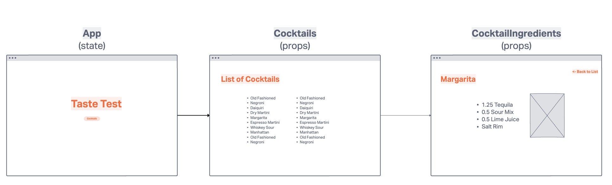
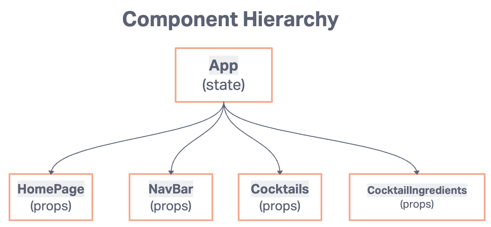
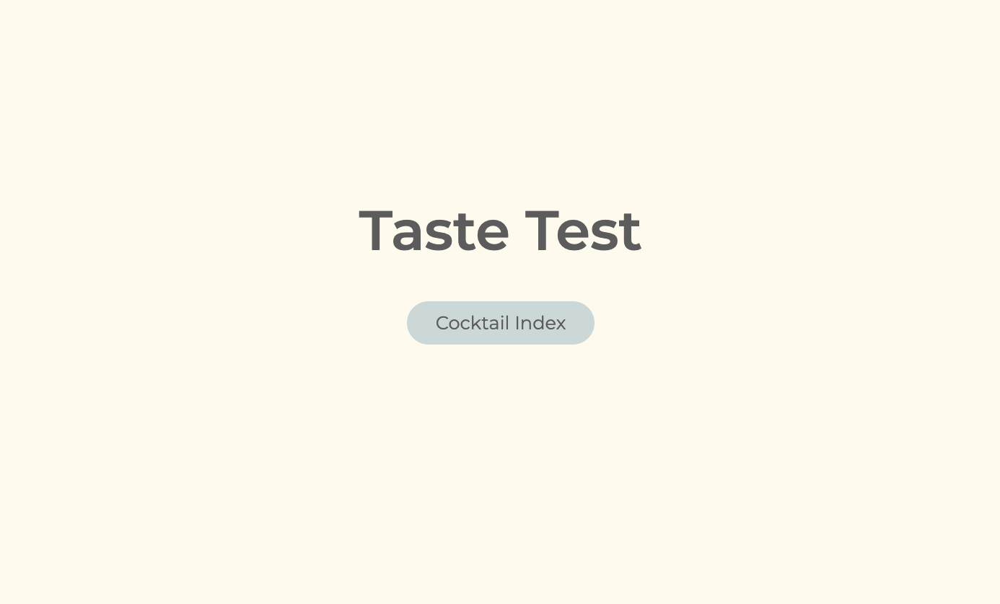
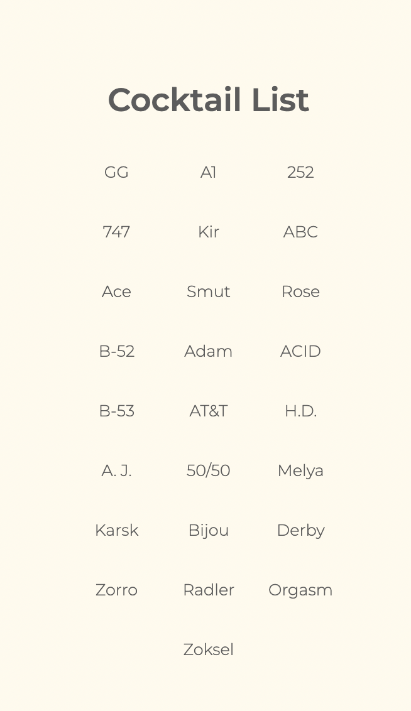
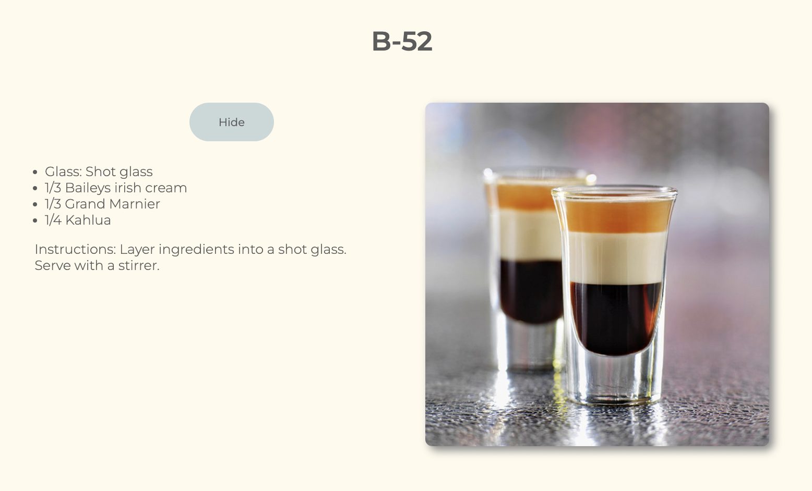

# Taste Test
Taste Test is an app that produces a list of popular cocktails, and allows you to view the measurements, ingredients, and glassware of any cocktail from the populated list. This app is created with the intention of serving as study guide for new bartenders, servers, or anyone joining the service industry.
I’ve worked in the service industry for over 10 years, and I remember how difficult it was in the beginning to memorize all the ingredients of the bar menu. I hope this app can help present that information in an intuitive and efficient way!

<hr style='border: 3px solid black'>

### Table of Contents

- [Getting Started/Installation](#getting-started)
- [Wireframe](#wireframe)
- [Technolgies Used](#technologies-used)
- [Coding Challenges](#coding-challenges)
- [Next Steps](#next-steps)
- [Contributions](#contributions)

<hr style='border: 3px solid black'>

## Getting Started / Installation
    1. Fork repo from GitHub
    2. Clone into code editor
    3. Install all necessary dependencies with:
        ```
        npm i
        ````
    4. To run the app in development mode:
        ```
        npm start
        ````

## Wireframe



## Site Preview




## Technologies Used
- React
- React-Router
- Javascript
- HTML
- CSS
- Trello and InVision for project planning

## Coding Challenges
The most challenging aspect of this project was learning how to access, parse, and render information from a third-party API.

## Next Steps
- Implement search functionality
- Implement User Login & OAuth
- Implement single randomized rendering of single cocktail, "pop-quiz" style, with timer

## Contributions
Front and back-end development: Nia Salgado<br/>
Please feel free to message me on Slack for any questions, suggestions, bug id's, and/or contributions! @Nia Salgado

## Acknowledgments
- Referenced class React Todos Lab to review toggle hide/show functionality
- Referenced class Star Wars Lab to review react routers
- Flex/grid styling tips: https://www.youtube.com/watch?v=phWxA89Dy94
- Adobe SEI'23 Instructional Team 

## Available Scripts
In the project directory, you can run:

### `npm start`

Runs the app in the development mode.\
Open [http://localhost:3000](http://localhost:3000) to view it in your browser.

The page will reload when you make changes.\
You may also see any lint errors in the console.

### `npm test`

Launches the test runner in the interactive watch mode.\
See the section about [running tests](https://facebook.github.io/create-react-app/docs/running-tests) for more information.

### `npm run build`

Builds the app for production to the `build` folder.\
It correctly bundles React in production mode and optimizes the build for the best performance.

The build is minified and the filenames include the hashes.\
Your app is ready to be deployed!

See the section about [deployment](https://facebook.github.io/create-react-app/docs/deployment) for more information.

### `npm run eject`

**Note: this is a one-way operation. Once you `eject`, you can't go back!**

If you aren't satisfied with the build tool and configuration choices, you can `eject` at any time. This command will remove the single build dependency from your project.

Instead, it will copy all the configuration files and the transitive dependencies (webpack, Babel, ESLint, etc) right into your project so you have full control over them. All of the commands except `eject` will still work, but they will point to the copied scripts so you can tweak them. At this point you're on your own.

You don't have to ever use `eject`. The curated feature set is suitable for small and middle deployments, and you shouldn't feel obligated to use this feature. However we understand that this tool wouldn't be useful if you couldn't customize it when you are ready for it.